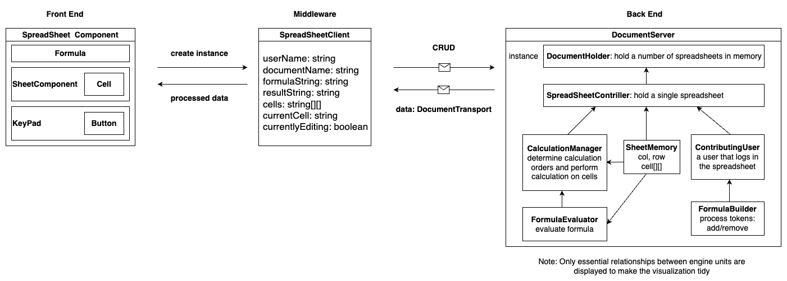

# CS5500-TeamHu

# Chat Feature for Assignment 3

## Design Document

### Nov 3, 2023

- Author: Zhongyu Wei
- Email: wei.zhon@northeastern.edu

### Version History

| Version | Date       | Author  | Description   |
| ------- | ---------- | ------- | ------------- |
| 1.0     | 2023-11-03 | Zhongyu | Initial Draft |
|         |            |         |               |
|         |            |         |               |

## Table of Contents

1. [Problem Statement](#problem-statement)
2. [Requirements](#requirements)
3. [High-Level Design](#high-level-design)
4. [Low-Level Design](#low-level-design)
5. [User Stories](#user-stories)
6. [Testing Documentation](#testing-documentation)

## 1. Problem Statement

The problem is to design a real-time chat system where each participant can exchange messages. The server maintains an ordered list of chat items, and the client displays the latest 20 items. Additionally, an advanced feature allows users to request more chat items.

## 2. Requirements

- Real-time Chat System
- Chat Window in Spreadsheet Editor Page
- Entry Pane for Each Participant
- Server Maintains an Ordered List of Chat Items
- Chat Item Format: "user: message"
- Display Latest 20 Chat Items
- Advanced Feature: Paged Fetch Method for More Chat Items

## 3. High-Level Design

The high-level design of the chat system involves the following components:

### 3.1. System Architecture

- Client-Server Architecture
- Real-time communication using WebSocket

### 3.2. Data Flow

- Messages flow from clients to the server and are maintained in a database
- Clients request and receive chat items from the server

## 4. Low-Level Design

### 4.1. Component A: Client

- Implements chat window in the spreadsheet editor page
- Provides an entry pane for participants to enter text
- Displays the latest 20 chat items
- Allows users to request more chat items via pagination scrolling

### 4.2. Component B: Server

- Receives and stores incoming chat messages
- Maintains an ordered list of chat items
- Provides a paged fetch method for retrieving chat items

### 4.3. Component C: Engine

- Manages communication between the client and server.
- Implements error handling and recovery mechanisms.
- Supports real-time updates and notifications.

## 5. User Stories

### 5.1. User Story 1

- ... (TBD)
- ... (TBD)

### 5.2. User Story 2

- ... (TBD)
- ... (TBD)

### 5.3. User Story 3 (Advanced)

- ... (TBD)
- ... (TBD)

## 6. Testing Documentation

### 6.1. Test Plan

- ... (TBD)
- ... (TBD)

### 6.2. Test Cases

- ... (TBD)
- ... (TBD)

## Conclusion

In conclusion, this design document outlines the requirements and design for a real-time chat system with the specified features. It covers the high-level architecture, component details, and user stories to guide development and testing.

## Appendices

